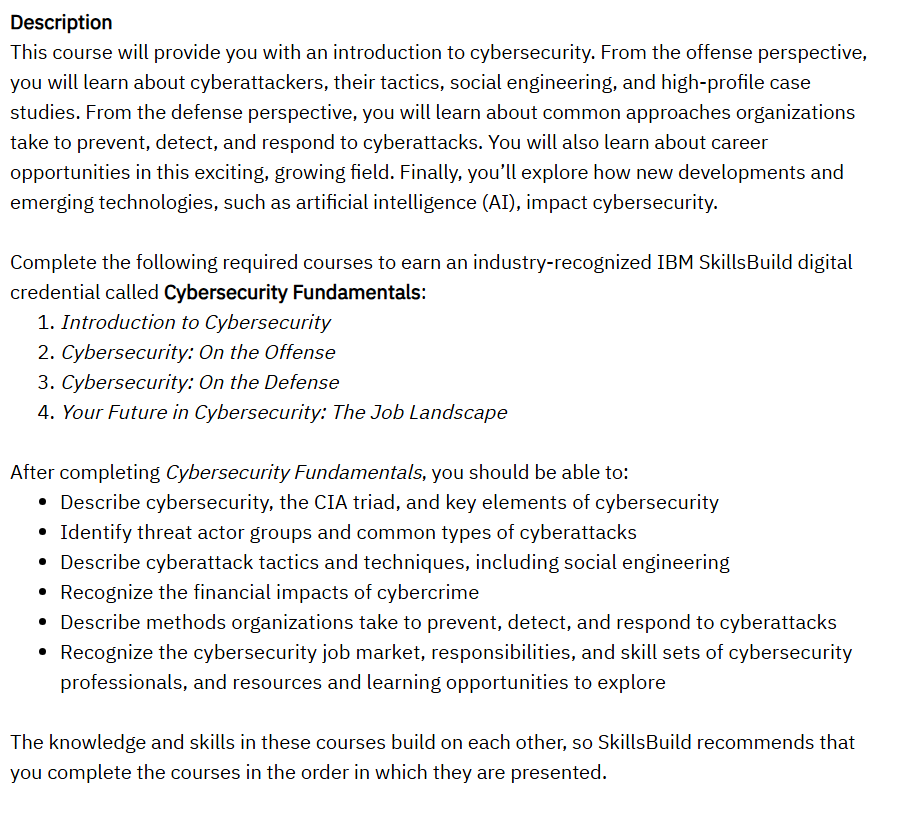

# 🛡️ IBM Cybersecurity Fundamentals  

This repository contains **notes, labs, playbooks, research case studies, and certificate of completion** for the *IBM Cybersecurity Fundamentals* program.  
The course provides a solid foundation in **cybersecurity concepts, network defense, incident response, and compliance**.  

---

## 📚 Notes  

- 📄 [`01-introduction.md`](./notes/01-introduction.md) – Introduction to the course  
- 📄 [`02-cybersecurity-basics.md`](./notes/02-cybersecurity-basics.md) – Cybersecurity fundamentals  
- 📄 [`03-network-security.md`](./notes/03-network-security.md) – Network defense essentials  
- 📄 [`04-threats-vulnerabilities.md`](./notes/04-threats-vulnerabilities.md) – Threats & vulnerabilities  
- 📄 [`05-incident-response.md`](./notes/05-incident-response.md) – Incident response lifecycle  
- 📄 [`06-cybersecurity-tools.md`](./notes/06-cybersecurity-tools.md) – Security tools overview  
- 📄 [`07-compliance-ethics.md`](./notes/07-compliance-ethics.md) – Compliance & ethics in cybersecurity  
- 📄 [`08-final-review.md`](./notes/08-final-review.md) – Final course review  

---

## 🧪 Labs  

- 🔍 [`lab-incident-response.md`](./labs/lab-incident-response.md) – Handling a security incident  
- 🌐 [`lab-network-security.md`](./labs/lab-network-security.md) – Network security lab  
- ✉️ [`lab-phishing-simulation.md`](./labs/lab-phishing-simulation.md) – Phishing attack simulation  

---

## 📋 Playbooks  

- ✅ [`detection-response.md`](./playbooks/detection-response.md) – Detection & response checklist  
- ✅ [`security-basics.md`](./playbooks/security-basics.md) – Cybersecurity hygiene & best practices  

---

## 🔬 Research  

- 📑 [`case-studies.md`](./research/case-studies.md) – Analyzed case studies  
- ⚔️ [`real-world-exploits.md`](./research/real-world-exploits.md) – Exploits & mitigation strategies  
- 📆 [`timeline.md`](./research/timeline.md) – Timeline of attacks & responses  

---

## 📖 Docs  

- 📘 [`glossary.md`](./docs/glossary.md) – Cybersecurity glossary  
- 📘 [`overview.md`](./docs/overview.md) – Program overview  
- 📘 [`references.md`](./docs/references.md) – References & external sources  
- 📘 [`roadmap.md`](./docs/roadmap.md) – Learning roadmap  
- 📘 [`syllabus.md`](./docs/syllabus.md) – Course syllabus  

---

## 📸 Screenshots  

| Step                  | Screenshot |
|-----------------------|------------|
| 🏫 Course Description |  |
| ⭐ Course Rating      |  |

---

## 📜 Certificate  

🎓 [`IBM Cybersecurity Fundamentals`](./cert/IBM%20Cybersecurity%20Fundamentals.png)  

---

## 📝 Personal Review  

This course provided me with a strong **foundation in cybersecurity**.  
The **labs on network defense and phishing simulation** gave hands-on experience in detecting and mitigating common threats.  
I particularly appreciated the **incident response module**, which helped me understand the structured approach to handling breaches.  

Overall, this program is a great starting point for anyone looking to **build a solid knowledge base in cybersecurity fundamentals**.  

---

## ✍️ Author  

**Thành Danh** – Red Team Learner & Security Researcher  

- GitHub: [@ngvuthdanhh](https://github.com/ngvuthdanhh)  
- Email: ngvu.thdanh@gmail.com   

---

## 📄 License  

This project is licensed under the terms of the **MIT License**.  
See [`LICENSE`](./LICENSE) for full details.  

© 2025 ngvuthdanhh. All rights reserved.  
